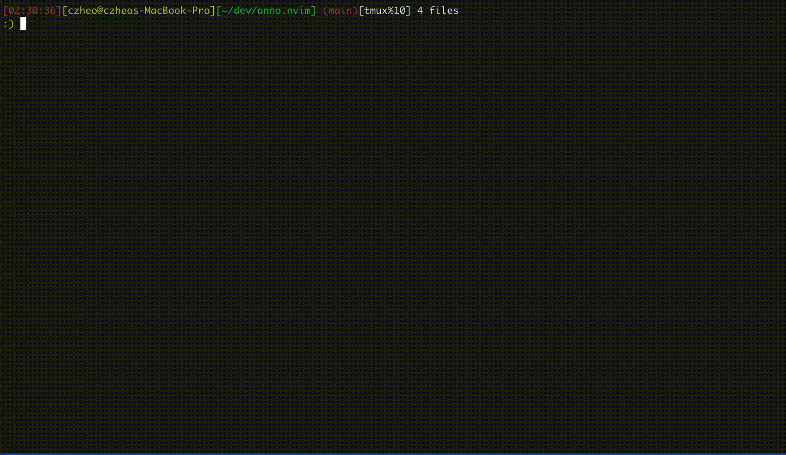

# anno.nvim

Add annotations in Neovim.

## Why?
When using coding agents such as Claude Code/Codex, I want to

- open a diff view to see the changes in the code.
- add comments to the code inline to instruct the agents.
- paste the comments back to the agents to continue the work.

In Claude Code/Codex, you can
- `ctrl-G` to call out Neovim, which opens a temp buffer.
- open a file or diff view (e.g. `diffview.nvim`)
- add inline comments `<leader>aa` using this plugin.
- copy all comments and paste `<leader>ap` them back to the temp buffer of coding agents.



## Installation (LazyVim)

```lua
{
  "czheo/anno.nvim",
  cmd = { "AnnoAdd", "AnnoEdit", "AnnoYank", "AnnoList", "AnnoRemoveAll", "AnnoRemove", "AnnoToggle", "AnnoNext", "AnnoPrev", "AnnoImport", "AnnoOutput", "AnnoGroup" },
  keys = {
    { "<leader>a",  "",                       desc = "+annotations" },
    { "<leader>aa", "<cmd>AnnoAdd<cr>",       desc = "Add annotation" },
    { "<leader>a", ":AnnoAdd<cr>",            desc = "Add range annotation",  mode = "v" },
    { "<leader>ae", "<cmd>AnnoEdit<cr>",      desc = "Edit annotation" },
    { "<leader>ad", "<cmd>AnnoRemove<cr>",    desc = "Delete annotation" },
    { "<leader>aj", "<cmd>AnnoNext<cr>",      desc = "Next annotation" },
    { "<leader>ak", "<cmd>AnnoPrev<cr>",      desc = "Previous annotation" },
    { "<leader>ay", "<cmd>AnnoYank<cr>",      desc = "Yank annotations" },
    { "<leader>al", "<cmd>AnnoList<cr>",      desc = "List annotations" },
    { "<leader>ap", "<cmd>AnnoYank<cr>p",     desc = "Yank&Paste annotations" },
    { "<leader>ai", "<cmd>AnnoImport<cr>",    desc = "Import annotations" },
    { "<leader>ao", "<cmd>AnnoOutput<cr>",    desc = "Output annotations" },
    { "<leader>ag", "<cmd>AnnoGroup<cr>",     desc = "Set annotation group" },
    { "<leader>aD", "<cmd>AnnoRemoveAll<cr>", desc = "Delete all annotations" },
    { "<leader>at", "<cmd>AnnoToggle<cr>",    desc = "Show/hide annotations" },
  },
}
```

## Commands
- `:AnnoAdd`
- `:'<,'>AnnoAdd`
- `:AnnoYank`
- `:AnnoList`
- `:AnnoEdit`
- `:AnnoRemove`
- `:AnnoToggle`
- `:AnnoNext`
- `:AnnoPrev`
- `:AnnoRemoveAll`
- `:AnnoImport {file}`
- `:AnnoOutput {file}`
- `:AnnoGroup {name} [#RRGGBB]`

`AnnoImport` appends to existing annotations. Use `:AnnoRemoveAll` first if you want to replace all.

`AnnoImport`/`AnnoOutput` use grouped JSON:

```json
{
  "version": 1,
  "groups": [
    {
      "name": "default",
      "color": "#ffff00",
      "annotations": [
        {
          "path": "/abs/path/to/file.lua",
          "start_line": 12,
          "end_line": 14,
          "text": "Refactor this block"
        }
      ]
    }
  ]
}
```

## Setup

```lua
require("anno").setup({
  highlight = "Todo",
  prefix = "↳ ",
  -- anno: { bufnr, extmark_id, path, text, start_line, end_line, filetype, code }
  yank_format = function(anno)
    return string.format(
      "@%s#%d-%d\nComment: %s\n\n```%s\n%s\n```",
      anno.path,
      anno.start_line,
      anno.end_line,
      anno.text,
      anno.filetype or "",
      anno.code
    )
  end,
})
```

## Testing

Requirements:
- Neovim
- `plenary.nvim` at `~/.local/share/nvim/lazy/plenary.nvim` (or set `PLENARY=...`)

Run tests:

```bash
make test
```

Custom plenary path:

```bash
PLENARY=/path/to/plenary.nvim make test
```
